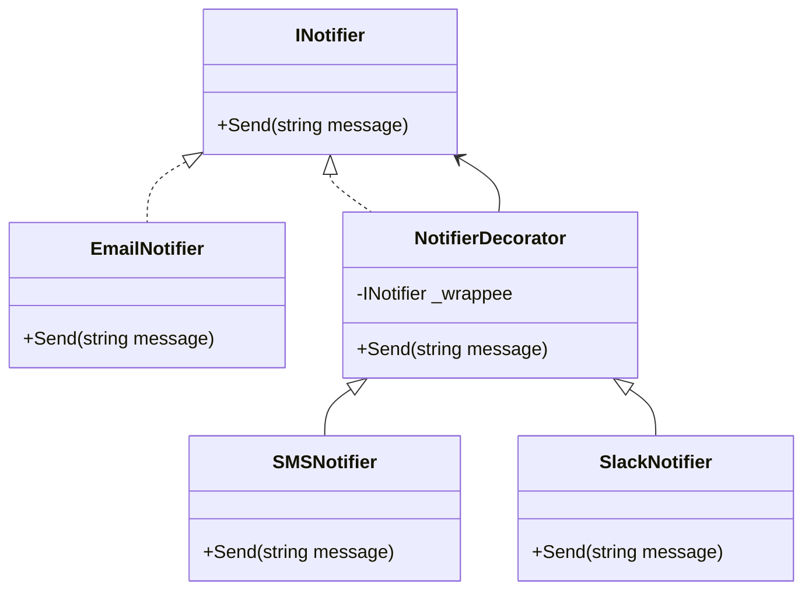

# Decorator Pattern in .NET

## Overview
The **Decorator Pattern** is a **structural design pattern** that allows behavior to be added to an object dynamically, without modifying its class.  

Instead of creating a large inheritance tree, the pattern uses **composition**:  
- A base component defines the core interface.  
- Concrete components implement the base behavior.  
- Decorators wrap components to extend or modify behavior.  

---

## Why Use the Decorator Pattern?
- Avoids **class explosion** from too many subclasses.  
- Adds new functionality **dynamically at runtime**.  
- Promotes **open/closed principle** → classes are open for extension but closed for modification.  
- Useful when you want to stack multiple behaviors.  

---

## Structure



## Components
- Component (INotifier) → Common interface for all notifiers.
- Concrete Component (EmailNotifier) → Base implementation.
- Decorator (NotifierDecorator) → Wraps a component.
- Concrete Decorators (SMSNotifier, SlackNotifier) → Add extra behavior.

## Benefits
- Flexible → Add/remove functionality at runtime.
- Composable → Multiple decorators can be stacked.
- Open/Closed Principle → Extend behavior without touching base class.
- You compose behaviors at runtime. Add layers of functionality as needed.

## Real-World Application
- Logging → Wrap services to log method calls.
- Caching → Wrap database queries with a caching decorator.
- Authentication → Wrap services with permission checks.
- UI Frameworks → Scrollbars, borders, shadows are decorators around components.

- ## Decorator vs. Inheritance
| Aspect              | Inheritance                       | Decorator                           |
| ------------------- | --------------------------------- | ----------------------------------- |
| Flexibility         | Fixed at compile-time             | Dynamic at runtime                  |
| Class Explosion     | Many subclasses needed            | Only a few decorators, reusable     |
| Extension Mechanism | Extend by creating new subclasses | Extend by wrapping existing objects |


## What Happened at Runtime?

Execution order when you ran:
- SlackNotifier.Send → Calls base.Send → Goes to SMSNotifier.Send
- SMSNotifier.Send → Calls base.Send → Goes to EmailNotifier.Send
- EmailNotifier.Send → Prints Sending Email: Hello World!
- Back to SMSNotifier → Prints Sending SMS: Hello World!
- Back to SlackNotifier → Prints Sending Slack Message: Hello World!

```csharp
Sending Email: Hello World!
Sending SMS: Hello World!
Sending Slack Message: Hello World!

Logically the call is executed like this -->

INotifier notifier = new SlackNotifier(
                        new SMSNotifier(
                            new EmailNotifier(
                                new Notifier())));

```

- Your EmailNotifier is the core. SMSNotifier & SlackNotifier are decorators wrapping it.
- Client decides which combo of notifications to send, without touching the original class.

