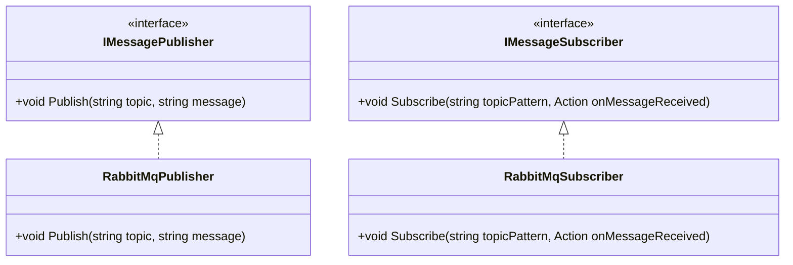

# Publisher-Subscriber Pattern (Pub/Sub) in .NET with RabbitMQ

## Overview
The **Publisher-Subscriber (Pub/Sub)** pattern is a messaging paradigm where publishers send messages without knowing who receives them, and subscribers receive messages without knowing who published them.  
This enables **loose coupling**, **scalability**, and **asynchronous communication** between services.

In this repository, we demonstrate the Pub/Sub pattern in **.NET** using **RabbitMQ** as the message broker.

---

## Architecture

```text
 Publisher ───► [Exchange/Topic] ───► Subscriber(s)
```



```mermaid
sequenceDiagram
participant Publisher
participant Exchange
participant Subscriber1 as Sports Subscriber
participant Subscriber2 as Weather Subscriber

Publisher->>Exchange: Publish("news.sports.football", "Match Update")
Exchange-->>Subscriber1: Matches topic "news.sports.*"
Subscriber1->>Console: [Sports Sub] Match Update

Publisher->>Exchange: Publish("news.weather.rain", "Heavy Rain Alert")
Exchange-->>Subscriber2: Matches topic "news.weather.#"
Subscriber2->>Console: [Weather Sub] Heavy Rain Alert
 ```

 ## How It Works
- Publisher → Sends messages (events) to a message broker
- Broker (RabbitMQ) → Routes messages based on topics or routing keys.
- Subscribers → Listen to specific topics and process matching messages.
- This allows one-to-many communication: one published message can reach multiple subscribers.

 ## Use Cases
- Event-driven microservices.
- Real-time notifications (chat, stock prices, live scores).
- Logging and monitoring systems.
- IoT event streaming.