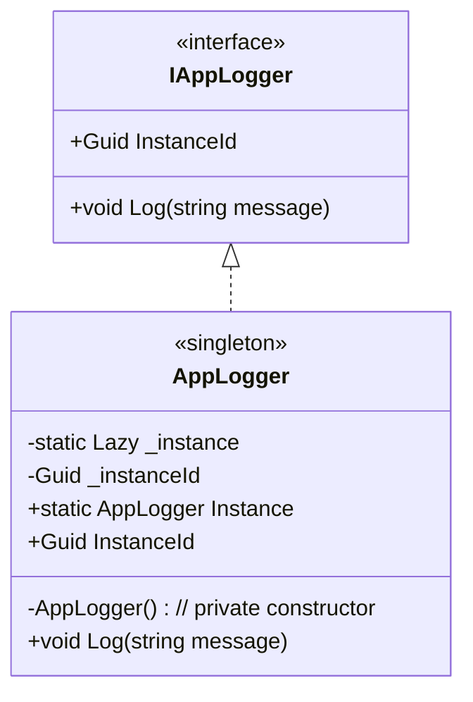
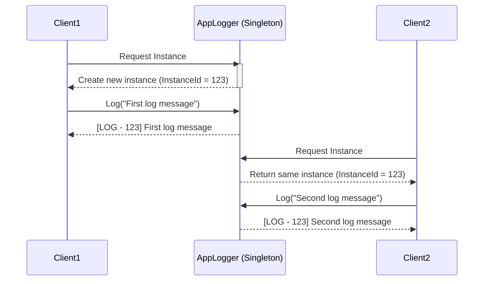

# Singleton Pattern (C#)

## Definition
The **Singleton Pattern** ensures that a class has only **one instance** and provides a global point of access to it.

## When to Use
- Configuration settings
- Logging
- Caching
- Thread pools
- Accessing hardware resources (like printers, file system)
- Any data which to be shared globally (same for every instance)

## Implementation in C#
We use:
- A **private constructor** → prevents creating objects with `new`.
- A **static property** → provides the single instance.
- `Lazy<T>` → ensures thread-safe, lazy initialization.
- builder.Services.AddSingleton<IAppLogger>(AppLogger.Instance);





## Why not use locks?
- Before .NET 4, locks were required for thread safety.
- Problems with lock-based implementations:
	- More verbose and complex
	- Minor performance overhead on every access
- With Lazy<T> (and CLR guarantees for static initialization):
	- No explicit locks needed
	- Thread safety built-in
	- Cleaner and more maintainable
	- Fast (after initialization, access is just a simple property read)

## Example
```csharp
var logger1 = Logger.Instance;
var logger2 = Logger.Instance;

logger1.Log("Message 1");
logger2.Log("Message 2");

// Both are the same instance
Console.WriteLine(ReferenceEquals(logger1, logger2));
